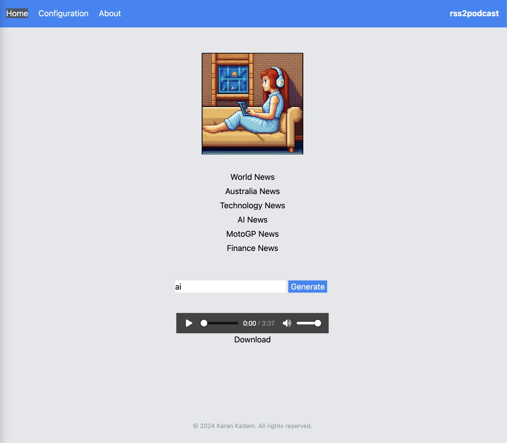

# rss2podcast

</img>

A locally hosted, AI generated podcast from an rss feed. 


Powered by -

</img>
</img>
</img>

## How it works
The application reads an rss feed, extracts the articles and summarises them. 

RSS + Ollama + TTS = Podcast

### RSS
The application reads an rss feed and extracts the articles. Each of these articles are then processed by scraping the article content.

### Ollama
The application uses a locally hosted version of Ollama. The Ollama API is used to summarise the article content. Default model used is mistral:7b

### TTS
The summarised article content is then converted into an audio podcast using the Coqui TTS API.

## Dependencies

This project requires the following dependencies to be installed on your system. 

### Ollama

You can install the Ollama server by following the instructions on the [official website](https://ollama.com).

Ollama needs to be running on your local machine for the application to work. The application is configured to use the default Ollama server URL `http://localhost:11434/api/generate`. This can be changed via the config.yaml file.

### ffmpeg

`ffmpeg` is a command-line tool for handling multimedia files. It is used to convert the generated audio files to the MP3 format.

#### macOS

You can use Homebrew to install `ffmpeg` on macOS:

```bash
brew install ffmpeg
```

#### Windows

1. Download the `ffmpeg` build for Windows from the [official website](https://ffmpeg.org/download.html).
2. Extract the downloaded ZIP file.
3. Add the `bin` directory from the extracted folder to your system's PATH.

#### Linux

The installation command depends on your Linux distribution.

##### Ubuntu/Debian

```bash
sudo apt update
sudo apt install ffmpeg
```

### Kokoro TTS (Recommended)

Kokoro TTS is a text-to-speech synthesis system that uses deep learning to create human-like speech from text. You can install the Kokoro TTS server by following the instructions on the [official website](https://github.com/nazdridoy/kokoro-tts).

#### Docker:
  
Create a docker-compose.yml file and add the following:

```yaml
services:
kokoro-fastapi-cpu:
    ports:
        - 8880:8880
    image: ghcr.io/remsky/kokoro-fastapi-cpu:v0.2.2
```

Start the server by running the following command:

```bash
docker compose up -d
```

This will start the Kokoro TTS server on port 8880. The server provides a REST API for text-to-speech conversion.

### Coqui TTS

Coqui TTS is a text-to-speech synthesis system that uses deep learning to create human-like speech from text. You can install the Coqui TTS server by following the instructions on the [official website](https://coqui.ai/tts).

#### Docker

Start the container by using the following command:

```bash
docker run -d -p 5002:5002 --platform linux/amd64 --entrypoint /usr/local/bin/tts-server ghcr.io/coqui-ai/tts-cpu --model_name tts_models/en/ljspeech/vits
```

## Installation 

Clone the repository and navigate into the directory:

```bash 
    git clone https://github.com/yourusername/your-repo.git
    cd your-repo
```

Then, install the dependencies:
```bash
go mod download
```

## Usage
To run the application, navigate to the cmd/rss2podcast directory and run:
```bash
go run main.go
```

## Testing
To run the tests, use the following command:
```bash
go test ./...
```

## Configuration

The application can be configured through the web interface or by editing the `config.yaml` file directly. The configuration options include:

### Podcast Settings
- `subject`: The topic or subject of your podcast
- `podcaster`: The name of the podcaster

### RSS Feed Settings
- `url`: The RSS feed URL to fetch content from
- `max_articles`: Maximum number of articles to process
- `filters`: List of keywords to filter out unwanted articles

### Ollama Settings
- `end_point`: The Ollama API endpoint
- `model`: The Ollama model to use for text generation

### TTS Settings
- `engine`: The TTS engine to use ("coqui" or "kokoro")
- `coqui.url`: The URL for the Coqui TTS service
- `kokoro.url`: The URL for the Kokoro TTS service

### TTS Requirements

#### Coqui TTS
- Requires a running instance of Coqui TTS server
- Default URL: http://localhost:5002/api/tts
- Installation and setup instructions: [Coqui TTS Documentation](https://github.com/coqui-ai/TTS)

#### Kokoro TTS
- Requires a running instance of Kokoro TTS server
- Default URL: http://localhost:8880/api/tts
- Installation and setup instructions: [Kokoro TTS Documentation](https://github.com/nazdridoy/kokoro-tts)

## Contributing
Contributions are welcome. Please open a pull request with your changes.

## License
This project is licensed under the terms of the MIT License.